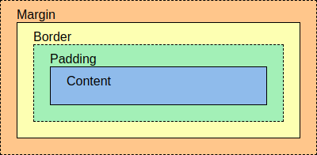

# Glossary

:::{glossary}
node
    A node is an element which can contain child nodes and/or other types of content. The position and size of the node on the canvas is determined by the style parameters of the node itself and the content of the node (child nodes or other types of content such as images and text). **stretchable** cannot intrinsically measure node contents (other than child nodes), but a custom measure function can be associated with each node to allow for layouts that include images, text, etc.

style
    The style of a node determines the size and position of the node relative to the canvas and other nodes. **stretchable** supports the *CSS Grid* and *Flexbox* styling algorithms.

frame
    A frame is a rectangle with a certain position (relative to the containing node or the root node) and size. The frame can correspond to different types of boxes as defined in the CSS box model. The position and size of the frame is the result of a layout computation.

CSS
    Cascading Style Sheets (CSS) is a stylesheet language used to describe the presentation of a document written in HTML or XML. **stretchable** uses the layout elements and algorithms of CSS (as implemented in [Taffy](https://github.com/dioxuslabs/taffy)).

CSS box model
    In CSS, the term "box model" is used when talking about design and layout. The CSS box model is essentially a box that wraps around every node/element. It consists of *content*, *padding*, *borders* and *margins*. The image below illustrates the box model:

    

content
    The content of the box, where text and images appear.

padding
    Clears an area around the content.

border
    A border that goes around the padding and content.

margin
    Clears an area outside the border.
